# 4412_PWM


## 一.设计任务

### （一）任务简介

#### 1.PWM驱动编写

通过编写PWM驱动代码，实现PWM信号的输出，并根据PWM信号控制直流电机的开关以及转速

#### 2.PWM驱动测试代码编写####

测试使用三种方式：

(1). 使用按键控制直流电机转速，并将转速等级在数码管上显示

(2). 使用QT控制直流电机转速

(3). 使用web控制直流电机转速


## 二.设计原理

### （一）简介

本项目使用基于FS-WSN4412的脉冲宽度调制（PWM）控制直流电机的开关以及转速。

### （二）PWM详解

#### 1.pwm简介

PWM是脉冲宽度调制即 Pulse Width Modulation 的缩写。PWM通过对一系列的宽度
进行调制，等效出所需要的波形的形状与幅值，对模拟信号电平进行数字编码，换言之，
通过调节占空比的变化，从而实现调节信号、能量等的变化。

#### 2.PWM信号输出方式

(1). 在有集成的PWM控制器的I/O口，通过对应的寄存器，使用芯片内部模块输出PWM
信号，这样的PWM输出在程序设计简便且数据精确。

(2). 通过给I/O加一个与所需PWM信号频率一致的定时器，使用定时器中断来计数来
输出反转电平的信号，即利用I/O口设置参数输出PWM信号。该方法用于没有IC内部没
有PWM模块或者精度、频率要求不高的项目。
在本项目中使用的是第一种方法。

#### 3.PWM信号应用
PWM信号把模拟信号转化为数字电路所需要的编码，现在基本是采用数字电路，因此在很多场合都采用PWM信号。

我们经常见到的就是交流调光电路，也可以说是无级调速，高电平占多一点，也就是占空比大一点亮度就亮一点，占空比小一点亮度就没有那么亮，前提是PWM的频率要大于我们人眼识别频率，要不然会出现闪烁现象。

除了在调光电路应用，还有在直流斩波电路、蜂鸣器驱动、电机驱动、逆变电路、加湿机雾化量等都会有应用。

即任何模拟值都可以使用PWM进行编码。


### （三）FS-WSN4412

#### 1.FS-WSN4412简介

华清远见ARM Cortex-A FS-WSN4412开发平台是由华清远见研发中心研发定制的ARMCortex-A9开发平台。FS-WSN4412采用三星ARM Exynos 4412四核处理器，运行主频可高达1.6GHz，其处理速度和节能能力比起双核大幅提高。其亦提供了丰富的板载资源以及扩展接口，搭配华清远见研发中心自主研发得FS-JTAG ARM仿真器，是非常完善的开发平台。本项目基于该开发平台编写PWM驱动以实现直流电机的开关
与调速。

#### 2.ARM体系结构和接口技术
    FS-WSN4412开发平台配合华清远见研发中心开发的FS-JTAG Cortex-A8/A9仿真器，可以实现接近ARM官方仿真器的功能。FS-JTAG支持全系列Windows平台，而且仿真器使用全套开源软件发开环境，IDE为使用相当广泛Eclipse，开发者可以轻易上手；编译器则使用GNU GCC，代码可以和Linux的代码实现无缝斜街，使开发者的学习难度大大降低，学习关联性紧密连接。
    在本项目中，借鉴到了ARM体系结构中的定时器(PWM)实验，该实验让我们对相关知识原理深入理解，对整个体系更加清晰，对知识更加深入。


### （四）直流电机

直流电机（direct current machine）指能将直流电能转换成机械能，在本项目中，
通过使用PWM信号调节均值电压的大小控制直流电机的转速以及开关。

## 三.设计方案以及实现

### （一）方案简介
开启PWM，控制PWM输出信号以调节直流电机转速。

### （二）PWM的开启
#### 1.FS-WSN4412电路图

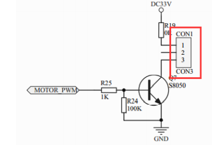


如图，PWM外接直流电机，可知：

(1). 该电机为直流电机，如果想调整电机转速，需要正负极有电流通过，我们通过生
成方波，实现图中三极管基极到发射极周期性导通和关闭使得直流电机的均值电压
产生变化，从而实现电能的变化，以调整直流电机转速
。

(2). 三极管的基极连接的是SOC的GPD0_0引脚。


#### 2.MOTOR_PWM

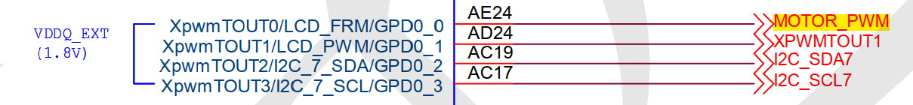
如图，MOTOR_PWM所用引脚的说明图，可知MOTOR_PWM联机的是XpwmTOUT0，并和
LCD一起复用引脚GPD0_0。

#### 3.GPD0_0
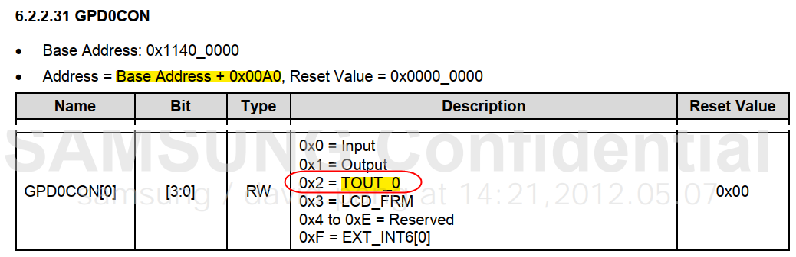
如图，GPD0_0使用说明图，可知：

(1). GPD0_0配置由地址为基础地址(0x1140_0000)加上0x00A0的GPD0CON[3:0]
寄存器控制。


```c
#define EXYNOS4412_GPD0CON  	0x114000A0
```

(2). 需要作为PWM输出，GPD0CON[3:0]要设置为TOUT_0即0x2，而关闭则设置Reserved即0x4到0xE。同时也可以看到，该引脚还可以设置为外部中断信号[EXT_INT6]功能即0xF。
```c
//装载GDP0CON,并将GPD0CON置为0x2，即开启
writel((readl(pwm_dev->gpd0con) & ~0xf) | 0x2,pwm_dev->gpd0con);

//装载GDP0CON,并将GPD0CON置为0x4，即关闭
writel((readl(pwm_dev->gpd0con) & ~0xf) | 0x4,pwm_dev->gpd0con);
```

### （三）PWM的控制


#### 1.PWM内部模块图
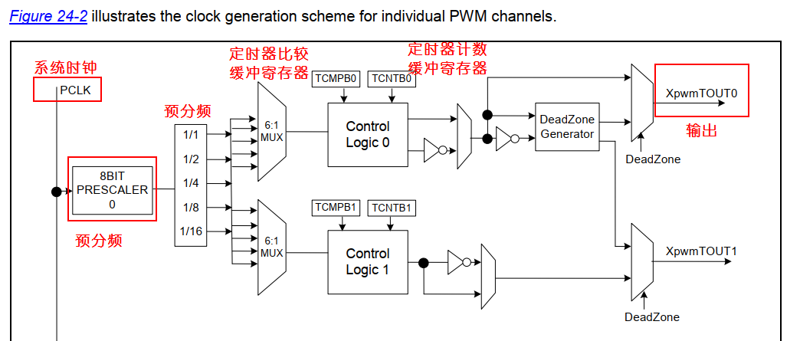


#### 2.模块概述
  (1). FS-WSN4412有多个32位PWM定时器，这些定时器产生中断给ARM子系统。而定时器使用ABP-PCIK作为源时钟。定时器0和1共享可编辑8位预分频器作为PCLK提供第一季分频。定时器2、3、4共享另外一个8位预分频器。每个计数器都有专用的时钟分频器，提供第二级时钟分频（预分频器除以2、4、8或16）。

  (2).每个定时器都有它的32位递减计数器，定时器时钟驱动这个计数器。定时器计数缓冲寄存器（TCNTBn）加载递减计数器的初始值。如果递减计数器达到零，它将生成计时器中断请求，通知CPU定时器操作完成。如果定时器下降计数器达到零，相应TCNTBn的值自动重新加载到下一个循环开始。但是，如果定时器停止，例如，在定时器运行模式下，通过清除TCONn的定时器使能位，TCNTBn的值将不会重新加载到计数器中。

  (3).PWM功能使用TCMPBn寄存器的值。定时器控制逻辑改变输出电平下计数器值与定时器控制逻辑中比较寄存器的值相匹配。因此，比较寄存器决定PWM输出的开启时间或关闭时间。

  (4).每个定时器都是双缓冲结构，带有TCNTBn和TCMPBn寄存器，允许定时器参数在周期中更新。新值在当前计时器周期完成之前不会生效。

#### 3.工作步骤
  (1). 当时钟PCLK被使能后，定时器计数缓冲寄存器（TCNTBn）把计数器初始值下载到递减计数器中。

  (2). 定时器比较缓冲寄存器（TCMPBn）把其初始值下载到比较寄存器中，并将该值与递减计数器的值进行比较。当递减计数器和比较寄存器值相同时，输出电平翻转。

  (3). 递减计数器减至0后，输出电平再次翻转，完成一个输出周期。这种基于TCNTBn和TCMPBn的双缓冲特性使定时器在频率和占空比变化时能产生稳定的输出。

  (4). 每个定时器都有一个专用的由定时器时钟驱动的16位递减计数器。当递减计数器的计数值达到0时，就会产生定时器中断请求来通知ＣＰＵ定时器操作完成。当定时器递减计数器达到０的时候，如果设置了Auto-Reload 功能，相应的TCNTBn的值会自动重载到递减计数器中以继续下次操作。

  (5). 然而，如果定时器停止了，比如在定时器运行时清除TCON中定时器使能位，TCNTBn的值不会被重载到递减计数器中。

  (6). TCMPBn 的值用于脉冲宽度调制。当定时器的递减计数器的值和比较寄存器的值相匹配的时候，定时器控制逻辑将改变输出电平。因此，比较寄存器决定了PWM 输出的开关时间。

#### 4.寄存器配置以及代码实现
由MOTOR_PWM引脚图我们可知，使用的是PWM控制器的timer 0，对应的寄存器组如下图所示：
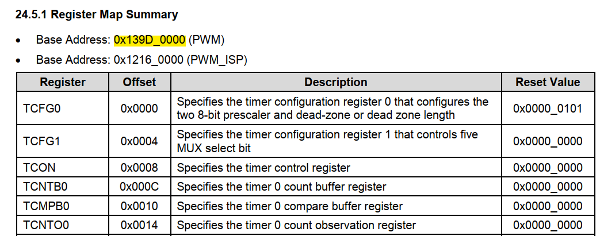

(1). 由图，可知我们使用timer0的Base Address为0x139D_0000，以及其寄存器组的地址，将地址值定义为对应的名字，方便后续装载。

```c
#define EXYNOS4412_TIMER_BASE  	0x139D0000

#define TCFG0	0x00
#define TCFG1	0x04
#define TCON	0x08
#define TCNTB0	0x0C
#define TCMPB0	0x10
```

(2). TCFG0与TCFG1
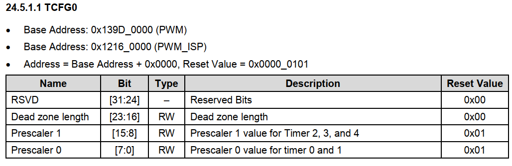
定时器配置寄存器0(TCFG0)，主要用于预分频(prescaler value)的设置,如上图，timer 0使用该寄存器的bite[7：0]。

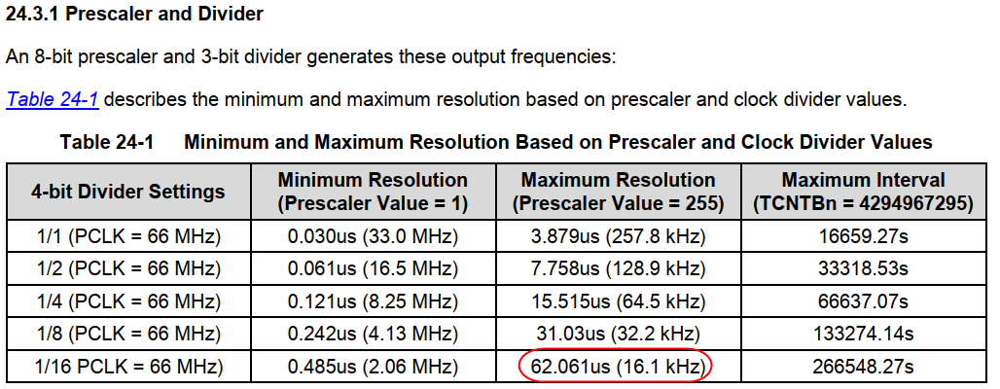
定时器配置寄存器1（TCFG1）， 主要用于PWM定时器的分频(divider value)设，如上图，可分别设置[1，2，4，8，16]并对应[0x0, 0x1, 0x2, 0x3, 0x4]。


一般而言，直流电机在设置TCFG0和TCFG1的值时，应该将频率设置在人耳听不见的范围，即不在20HZ~20KHZ之间。而输出频率公式如下：
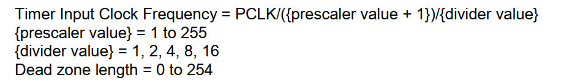
我们在多次实验中，在人耳音频范围外的值直流电机转速的控制并不明显，我们最终敲定prescaler value的值为249，divider value的值为16，输出频率为16.5KHZ。预分频以及分频装载代码如下：

```c
writel((readl(pwm_dev->timer_base + TCFG0) & ~0xff) | 0xf9,pwm_dev->timer_base + TCFG0);
	writel(readl(pwm_dev->timer_base + TCFG1) & ~ 0xf | 0x2 ,pwm_dev->timer_base + TCFG1);
```

(3). TCON
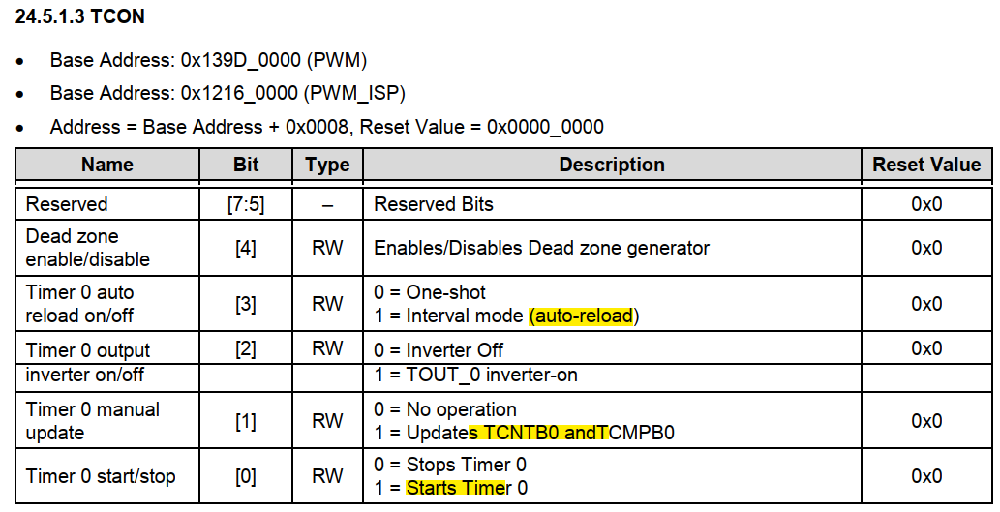
如上图，timer控制寄存器TCON，我们所需三种使用情况：

- bite[3] : 设置定时器是只执行一个周期(One-shot)还是周期执行（auto-reload）
```c
writel((readl(pwm_dev->timer_base + TCON) & ~0xff) | 0x4 ,pwm_dev->timer_base + TCON);
```

- bite[1]: 置为1，则更新TCNTB0 、TCMPB0 的值
```c
writel((readl(pwm_dev->timer_base + TCON) & ~0xff) | 0x1 ,pwm_dev->timer_base + TCON);
```

- bit[0]：开启或者停止定时器
```c
writel((readl(pwm_dev->timer_base + TCON) & ~0xff), pwm_dev->timer_base + TCON);
```

(4). TCNTB0与TCMPB0
定时器计数缓冲寄存器（TCNTB0）和定时器比较缓冲寄存器（TCMPB0），这两个值用于设定占空比，其地址如下图：
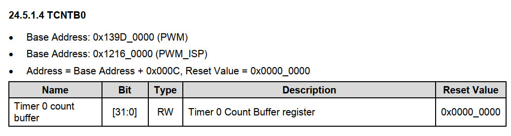
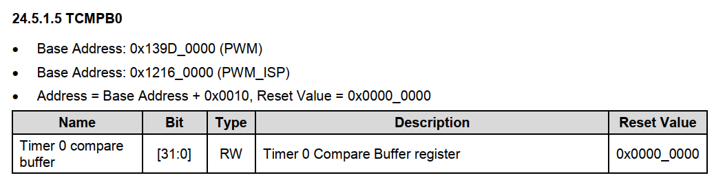
本项目一共设置两个转速，分别为一级转速和二级转速。
```C
#define FRE 25000
//设置两个转速
if(nr==1){
    writel(FRE/1000, pwm_dev->timer_base + TCNTB0);
    writel(FRE/2000, pwm_dev->timer_base + TCMPB0);
}else if(nr==2){
  writel(FRE/200, pwm_dev->timer_base + TCNTB0);
  writel(FRE/400, pwm_dev->timer_base + TCMPB0);
}
```
如上述代码，我们通过实验，使用占空比控制直流电机的转速并不明显，最终我们设定总的占空比为50，并通过调整定时器计数器的长度（即调整反转电频的时间）来控制直流电机的转速。

__综上__,寄存器组配置已经完成，并转为代码实现了PWM的控制。

### (四). PWM的使用
>本例主要简略解释各个部件功能与使用，顺序不分调用先后。

#### 1. 装载代码与使用代码的封装
    (1). 指定初始化，挂载驱动的时候要使驱动不被卸载卸载。
    (2). 封装PWM的启动与代码（open与release）
    (3). 封装PWM的使用代码。

```c
static struct file_operations fs4412_pwm_fops = {
	.owner = THIS_MODULE,
	.open = fs4412_pwm_open,
	.release =fs4412_pwm_release,
	.unlocked_ioctl = fs4412_pwm_unlocked_ioctl,
};
```

#### 2. PWM驱动的构造

    (1). 在/dev下创建驱动文件
```c
struct class *cls;
cls = class_create(THIS_MODULE, "pwm");
device_create(cls, NULL, devno, NULL, "pwm");
```
    (2). 创建设备号并注册
```c
dev_t devno = MKDEV(PWM_MAJOR, PWM_MINOR);
ret = register_chrdev_region(devno, PWM_NUM, "pwm");
```

### (五). 实验论证
    编写基本测试文件，确认直流电机的转速明显可调，直流电机明确可被开启以及关闭，测试主要代码如下：
```c

	int dev_fd;
	int i = 0;
  //开启设备，若开启失败则退出
	dev_fd = open("/dev/pwm",O_RDWR | O_NONBLOCK);
	if ( dev_fd == -1 ) {
		perror("open");
		exit(1);
	}
  //控制PWM，分为两级
	while(1) {
		printf("rate level: %d\n", i);
		ioctl(dev_fd, SET_CNT, &i);
		getchar();
		if ( i == 2) {
			i = 0;
			continue;
		}
		i++;
	}

	return 0;
```

## 四.系统测试与性能分析
### (一).基于QT的测试方案
#### 1.测试步骤：
    (1). 搭建并使用TFTP和NFS环境，使用提前准备并编译好的内核。编译PWM驱动代码并传至nfs文件系统目录下，挂载驱动。
    (2). 编译QT文件并将运行文件传至nfs文件系统目录下。
    (3). 运行QT文件，并在FS-WSN4412 TouchScreen上做展示。

#### 2.结果分析
    (1). 在TouchScreen上使用QT文件能正常控制直流电机转速与开关，并能将等级显示在TouchScreen上。

#### 3.测试文件略解
    (1). 将连接驱动的代码写成类，另外写QT的界面以及逻辑，使用QT调用连接驱动的代码。


### (二).基于按键的测试方案
#### 1.测试步骤：
    (1). 搭建并使用TFTP和NFS环境，使用提前准备并编译好的内核。编译PWM驱动代码、按键驱动代码以及数码管驱动代码并传至nfs文件系统目录下，挂载驱动。
    (2). 使用FS-WSN4412上的音量键。

#### 2.结果分析：
    (1). 按下音量键能够控制直流电机的转速，并将等级显示在数码管上。

#### 3.测试文件略解：
    (1). 将使用PWM以及数码管的代码写入音量键的驱动代码中，使得音量键能够使用PWM以及数码管。

### (三).基于Web的测试方案
#### 1.测试步骤：
    (1). 搭建并使用TFTP和NFS环境，使用提前准备并编译好的内核。编译PWM驱动代码，挂载驱动。
    (2). 准备好页面文件以及后台使用硬件的代码，更改FS-WSN4412与电脑的IP地址使得电脑能够通过HTTP协议连上试验箱。
    (3). 网页连接FS-WSN4412(FS-WSN4412的IP)，使用页面组件控制直流电机。

#### 2.结果分析：
    (1). 按下页面按钮能控制直流电机的转速。

#### 3.测试文件略解：
    (1). 页面文件中调用后台代码，使用PWM控制直流电机。


## 五.结论
本项目在编写代码前，从FS-WSN4412电路图到PWM内部模块图、PWM原理图再到寄存器组图，层层深入，将各个组件各个装载一点一点搭建起来，然后封装使用。在这个过程中进一步学习Linux的使用以及驱动的开发，并对c/c++有了更深层次的了解，以及拾起电子电路的知识。该项目的开发是对我们组组员的一次挑战，也是我们对知识的深化理解与运用的机会，非常感谢老师、这门课以及这个项目给予我们的种种挑战以及知识。

## _附录_
### (一). 参考资料
- SEC_Exynos 4412 SCP_Users Manual_Ver.0.10.00_Preliminary

- FS4412_CoreBoard_V2（华清远见-WSN4412资料-2016-09-06-ESP8266-4G）

- WSN_4412_DEV_V7（华清远见-WSN4412资料-2016-09-06-ESP8266-4G）

- 嵌入式Linux移植应用驱动


